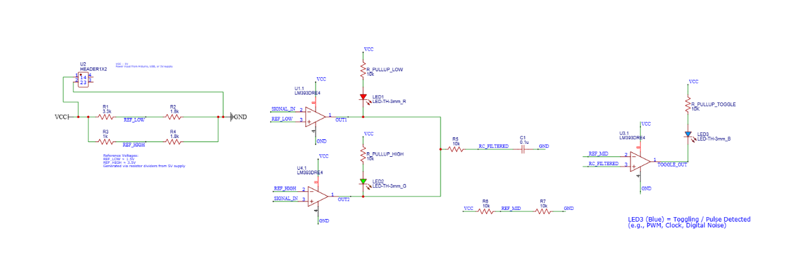
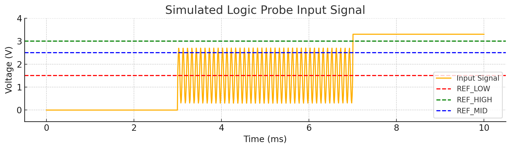

# 🔍 Logic Probe PCB v1.0

This logic probe tool was designed to identify signal states (LOW, HIGH, or PWM activity) on a digital line. It leverages voltage reference dividers, comparators, and an RC filter to reliably distinguish between static and pulsed inputs.

---

## 🧠 Functional Overview

- **Signal Input** is compared to three voltage levels:
  - **REF_LOW (≈1.5V)**: If the signal is below this, it's considered LOW.
  - **REF_HIGH (≈3.0V)**: If the signal is above this, it's considered HIGH.
  - **Between REF_LOW and REF_HIGH**: Signal is indeterminate — possibly PWM or noise.

### ⚙️ Comparators Used

| Comparator | Function                          | Output LED     |
|------------|-----------------------------------|----------------|
| `U1`       | Signal < REF_LOW                  | `LED1` (🔴 Red for LOW) |
| `U4`       | Signal > REF_HIGH                 | `LED2` (🟢 Green for HIGH) |
| `U3`       | PWM Detected (via RC Filter)      | `LED3` (🔵 Blue for PWM) |

---

## ⚡ Reference Thresholds (VCC = 5V)

The logic probe operates assuming a 5V logic level. The voltage dividers create reference points to distinguish between LOW, HIGH, and toggling states:

| Reference     | Approx. Voltage | Description                                    |
|---------------|------------------|------------------------------------------------|
| `REF_LOW`     | ~1.5 V           | If signal is below this → considered **LOW**   |
| `REF_MID`     | ~2.5 V           | Midpoint used to detect PWM/toggling signals   |
| `REF_HIGH`    | ~3.0–3.3 V       | If signal is above this → considered **HIGH**  |

- **PWM signals** that toggle rapidly (e.g., square waves) are **averaged** by the RC filter into a mid-level voltage.
- By comparing this average to `REF_MID`, the circuit can distinguish between static and dynamic signals.

These thresholds are set using **resistor dividers** (R1–R4 for LOW/HIGH, R6–R7 for MID), calculated relative to VCC (5V).

---

## 🎛️ RC Filter Functionality

The **RC filter**, composed of `R5` and `C1`, is a **low-pass filter** that smooths out high-frequency transitions. This is essential for identifying PWM signals. When a signal toggles rapidly, the filtered output settles at a middle voltage, which is then compared to **REF_MID** (~2.5V) using comparator `U3`.

Without the RC filter, the circuit wouldn’t be able to distinguish between actual digital states and noisy or high-frequency data lines.

---

## 🔌 Reference Voltage Dividers

| Voltage     | Divider Components   |
|-------------|----------------------|
| `REF_LOW`   | `R1` and `R2`        |
| `REF_HIGH`  | `R3` and `R4`        |
| `REF_MID`   | `R6` and `R7`        |

Each divider scales `VCC` into usable thresholds for the comparators.

---

## 🧾 Annotated Schematic

The following schematic maps the logic described above to the physical design.

---

## 📈 Waveform Simulation

Below is a simulated signal passing through LOW, PWM, and HIGH regions. The dashed lines represent the logic thresholds.

---

## 🧱 3D Preview

View of the final PCB board with all labeled components.

---

## 🧠 Summary

This project demonstrates your ability to:
- Design with analog comparators
- Create and apply RC filters
- Use voltage dividers for reference generation
- Design and route PCBs in EasyEDA
- Document functional logic clearly

---

## 📦 Contents

- `Gerber_Logic-Probe-Tool...` – Fabrication files
- `PCB_PCB_Logic-Probe-Tool...` – PCB layout project
- `Schematic_Logic-Probe-Tool...` – Source schematic
- `3D view.png` – Rendered 3D model
- `README.md` – Project documentation (you’re reading it!)

---

## 🧠 Author

**Asaf Alber**  
Logic Probe PCB Designer – May 2025  
GitHub: [Asaf-Alber](https://github.com/Asaf-Alber)
